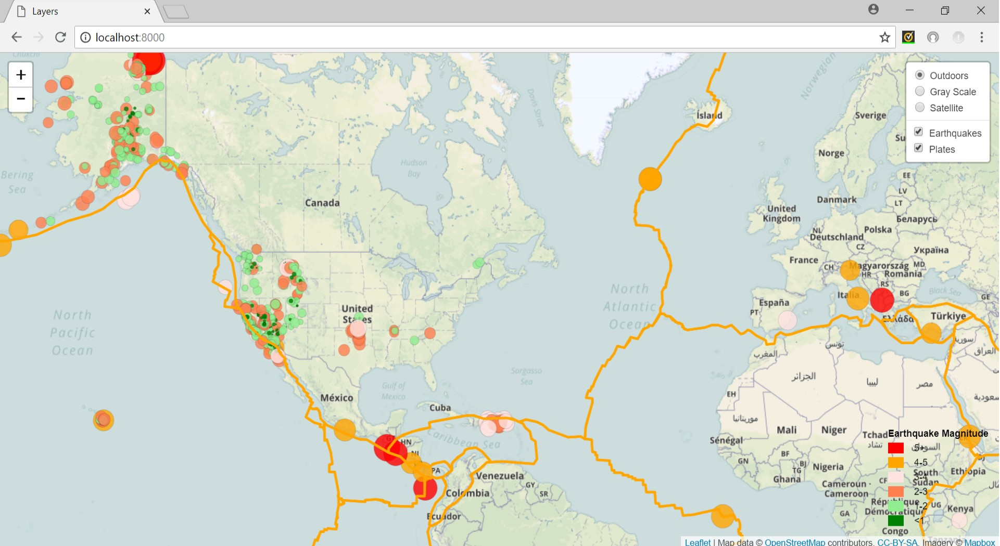

# earthquake_map
Visualizing earthquake data on map with leaflet

This project gets the earthquake data for the past 7 days from USGS web site, shows them on the map, along with tectonic plate overlay.

